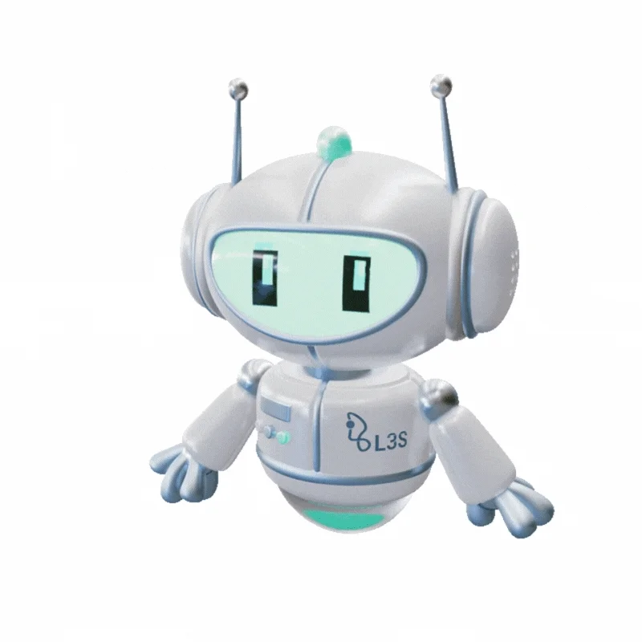

<p align="center"></p>


<div align="center">
  
</div>

<h2 align="center">🚀 About Me</h2>

```python
class Sabih:
    def __init__(self):
        self.name = "Sabih Dordab"
        self.role = "Junior Software Engineer"
        self.language_spoken = ["fa_IR", "en_US"]
        self.code = ["Python", "Django", "Java", "C++", "JavaScript"]
        self.tools = ["Docker", "Git", "Linux", "Unit Testing", "TDD"]
        self.interests = ["Web Development", "Machine Learning", "Data Analysis"]
        self.databases = ["SQL", "PostgreSQL", "SQL Server"]
        self.education = "Computer Engineering @ Shahid Chamran University of Ahvaz"
        
    def say_hi(self):
        print("Thanks for dropping by! Let's create something!")

me = Sabih()
me.say_hi()
```

<h2 align="center">🛠️ Tech Stack</h2>

<h3 align="center">Languages & Frameworks</h3>
<p align="center">
  
  
  
  
  
</p>

<h3 align="center">Tools & Technologies</h3>
<p align="center">
  
  
  
  
  
</p>

<h3 align="center">Databases</h3>
<p align="center">
  
  
  
</p>

<h3 align="center">Data Science & ML Libraries</h3>
<p align="center">
  
  
  
  
  
</p>

<h2 align="center">🧠 Currently Exploring</h2>

<p align="center">
  
  
  
</p>

<h2 align="center">🏆 Achievements</h2>

- 👨‍🏫 Teaching Assistant for Fundamentals of Programming (C++) at Shahid Chamran University

<h2 align="center">📊 GitHub Stats</h2>

<p align="center">
  
</p>

<p align="center">
  
</p>


<h2 align="center">📫 Let's Connect</h2>

<p align="center">
  <a href="https://linkedin.com/in/sabihedordab">
    
  </a>
  <a href="mailto:sabihd0rd4b@gmail.com">
    
  </a>
  <a href="https://instagram.com/83.97.98.105.104">
    
  </a>
  <a href="https://t.me/s4bih">
    
  </a>
</p>

---

<p align="center">
  <i>🌱</i>
</p>